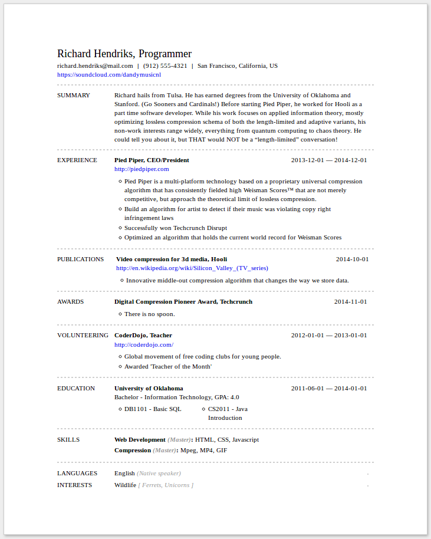
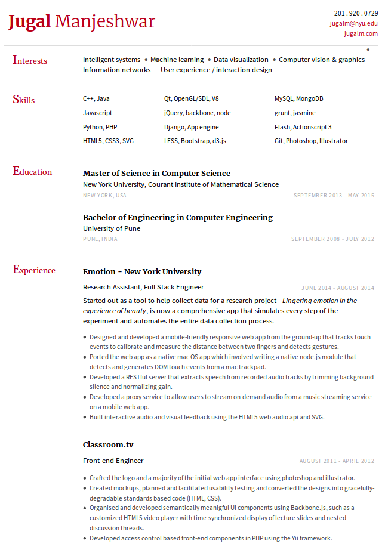

# Awesome Resume for Chinese

适合中文的简历模板

## How to Contribute

请见[贡献指南](./contributing.md)!

## LaTeX

- [dyweb/Deedy-Resume-for-Chinese](https://github.com/dyweb/Deedy-Resume-for-Chinese) 适合应届毕业生的 LaTeX 简历模板，by [@dyweb](https://github.com/dyweb)

	
    

- [cv_resume](https://github.com/geekplux/cv_resume) 中文简历 Latex 模板。基于 ModernCV 模板，进行了中文字体支持和优化，by [@geekplux](https://github.com/geekplux)

	

- [billryan/resume](https://github.com/billryan/resume) An elegant \LaTeX\ résumé template, by [@billryan](https://github.com/billryan)

## HTML/JS

PS: 大部分 HTML/JS 的中文支持都不是问题，因此截图并不全是中文简历。

- [Ovilia/cv](https://github.com/Ovilia/cv) Wenli Zhang's CV as Web Front-End Engineer, by [@Ovilia](https://github.com/Ovilia)

	

- [JSON Resume](https://jsonresume.org/) The open source initiative to create a JSON-based standard for resumes. For developers, by developers. OnePage 模板：

	

- [nuterian/resume](https://github.com/nuterian/resume) by [@nuterian](https://github.com/nuterian)

	

